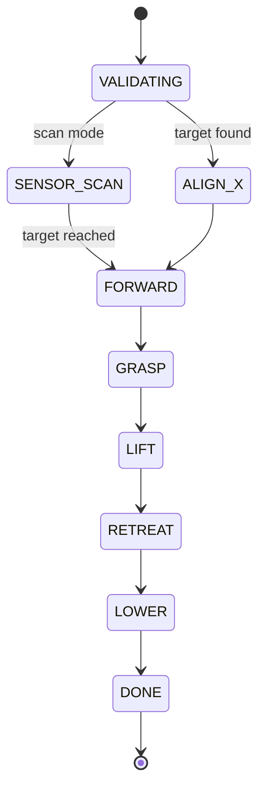

# AlignGrasp

[](https://github.com/WallyHao/align-grasp/actions/workflows/ci.yml)
[](LICENSE)
[](https://docs.ros.org/en/jazzy/)
[](https://www.python.org/)
[](https://github.com/astral-sh/ruff)
[](src/pick_action/test)

**Millimeter-level alignment perception and autonomous grasping for a ROS 2 robot.**

AlignGrasp turns a 2D LiDAR scan and a set of ranging sensors into a repeatable
pick sequence: validate the scene, align the gripper, drive forward, grasp,
lift, retreat and lower. It is exposed as a single ROS 2 action and can be
driven from any client. Four alignment strategies cover everything from
LiDAR-based target recognition to a blind, hardware-timed pick.

## Highlights

- **Four alignment strategies**, selectable at runtime with one parameter.
- **Multi-frame spatial voting** on a millimetre grid plus **multi-scale
  candidate separation** to recognise 5-6 tightly spaced targets despite
  single-line LiDAR noise and merged returns.
- **Pose correction** that fuses two ranging sensors with the Odin yaw to place
  the gripper in the field frame.
- **Explicit pick state machine** exposed as a ROS 2 action with per-state
  feedback.
- **ROS-independent algorithm core** with a fast offline unit-test suite.

## Pick Sequence



The action server publishes each state as feedback and can be aborted at any
step. A grasp that times out is retried exactly once before the goal fails.

## Alignment Modes

| Mode | `alignment_mode` | Strategy |
| --- | --- | --- |
| LiDAR recognition | `lidar_recognition` | Recognise targets from `/scan`, then align with the `prepare` tool action |
| Odin + ranging correction | `odin_sensor_projection` | Project the target onto the gripper heading using two ranging sensors and the Odin pose |
| No alignment | `no_alignment` | Blind, hardware-timed forward pick |
| Ranging scan | `sensor_scan_no_alignment` | Slowly sweep the gripper using one ranging sensor, stop on contact, then pick |

The full Chinese parameter reference for every mode is in
[`docs/modes.zh.md`](docs/modes.zh.md).

## Build

```bash
git clone https://github.com/WallyHao/align-grasp.git
cd AlignGrasp
source /opt/ros/jazzy/setup.bash
rosdep install --from-paths src --ignore-src -r -y
colcon build --symlink-install
source install/setup.bash
```

The real tool node (`/ares_tool_node/tool_action`) lives in the ARES
workspace, not here; this repository ships only the `ares_tool_interfaces`
service package it depends on.

## Run

```bash
# with real 2D LiDAR
ros2 launch pick_action pick_action.launch.py port_name:=/dev/ttyUSB0

# without LiDAR hardware, using a synthetic scan
ros2 launch pick_action pick_action.launch.py use_synthetic:=true

# trigger a pick sequence
ros2 action send_goal /pick_action pick_action_interfaces/action/PickSequence \
  "{expected_count: 3}" --feedback
```

Select the strategy in `src/pick_action/config/pick_action.yaml`:

```yaml
alignment_mode: sensor_scan_no_alignment
```

## Interfaces

| Name | Type | Direction |
| --- | --- | --- |
| `/pick_action` | `pick_action_interfaces/action/PickSequence` | action server |
| `/ares_tool_node/tool_action` | `ares_tool_interfaces/srv/ToolAction` | client |
| `/cmd_vel`-style chassis / lift topics | `std_msgs/Float32MultiArray` | publish |
| `/pick_action/status` | `std_msgs/String` (JSON) | publish |
| `/scan` | `sensor_msgs/LaserScan` | subscribe |
| `/spear_recognition/result` | `std_msgs/String` (JSON) | subscribe |
| `/sensor_distances` | `std_msgs/Float32MultiArray` | subscribe |
| `/odin1/relocation` | `geometry_msgs/PoseStamped` | subscribe |

## Project Layout

```text
src/
  pick_action/                 ament_python package: action server, nodes, algorithms
    pick_action/core.py        ROS-independent scan filtering and clustering
    pick_action/temporal_recognition.py  Multi-frame voting and target selection
    pick_action/pose_alignment.py        Odin / ranging pose correction
    test/                      Offline unit tests for the algorithm core
  pick_action_interfaces/      PickSequence action definition
  ares_tool_interfaces/        ToolAction service definition
  ldlidar_stl_ros2/            Vendored LDROBOT STL-27L driver
```

## Testing

The algorithm core does not import ROS, so the test suite runs anywhere:

```bash
cd src/pick_action
python -m pytest -q
```

CI additionally runs `ruff check` and `ruff format --check`. The full ROS build
is exercised locally with `colcon build` and `colcon test`.

## License

Released under the [MIT License](LICENSE). The vendored LDROBOT driver keeps
its own license in `src/ldlidar_stl_ros2/LICENSE`.
